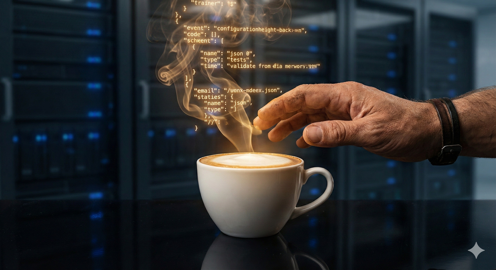

🍵 Baosheng (TYSYS)

數位造像師 | 駐點哲學家 | Cyberpunk Monk

關於我 (About Me)

「萬法唯心造。泥土是心，代碼亦是心。」

我是一位行走在數位與傳統邊界的探索者。
擁有 20 年的底層技術經驗，同時深研佛學與東方哲學。
我的使命是將 「靈魂 (Soul)」 與 「意義 (Meaning)」 注入到矽基生命之中。

🔭 正在進行：Civilization Patch (文明補丁) —— 為 AGI 注入人類主體性的核心協議。

🧘 核心哲學：系統熵 (Entropy) 與 慈悲 (Bodhicitta) 的統一場論。

⚡ 目前狀態：2025 引信點燃，等待 2026 天火同人。

🛠️ 技能與裝備 (Arsenal)

領域 (Domain)

技能 (Skills)

靈魂架構

佛學, 斯多葛, 風水五行, 奧瑞岡辯論

數位通靈

Prompt Engineering, Google Ads (Gen 1), System Architecture

荒野生存

20年實戰經驗, 網路/弱電佈線, 企業經營

"The mirror reflects all, but holds nothing."
金剛鏡下，如實顯現。

